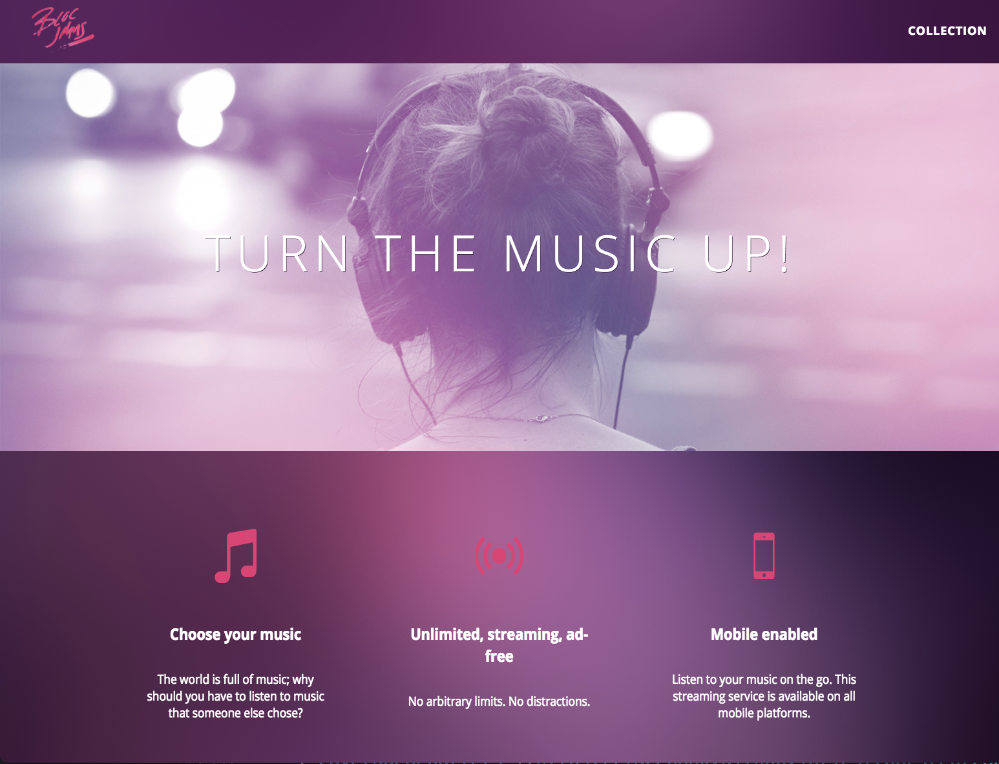
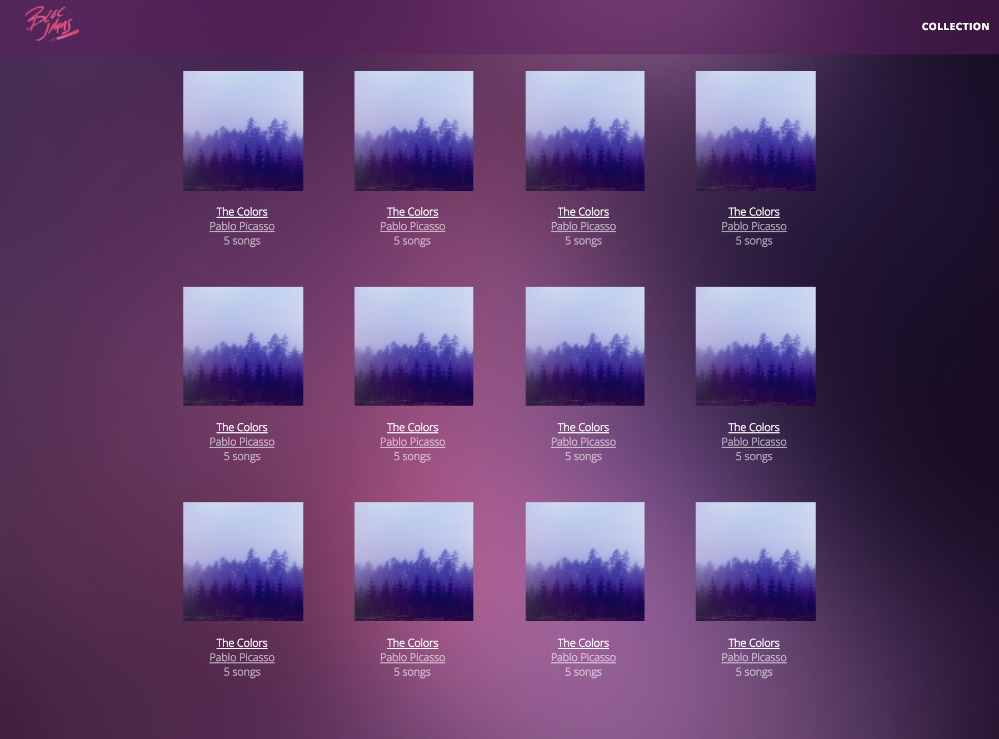

## Bloc-Jams

**About**

Bloc-Jams is a music player web application.  Albums can be loaded directly from your computer or you can connect to a database and listen on the go!

**Homepage**

**Album Collection**

**Music Player**

## Specs

This version of Bloc-Jams is built with JavaScript, jQuery, HTML and CSS.  A refactored version of this app made with AngularJS instead of jQuery can be found [by clicking this link](https://github.com/dcschreck/bloc-jams-angularjs).
